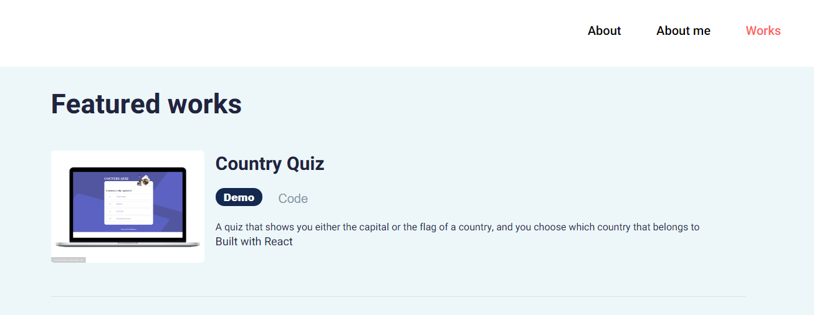

# Portfolio
This is my personal portfolio.

## Features
 - The website has three pages including the homepage that basically summarizes all contents in the website, a brief about me and works page that contains a few projects that I have done
 - The projects that are being displayed in the homepage are limited to 3 but all are seen in works page
## Screenshots

1. Homepage in mobile

1. Homepage in desktop

 1. Works in desktop

## Demo
 You can see my demo by clicking [this link](https://portfolio-rinon.netlify.app/)
## Technologies used
 - It is mainly built with [React](https://reactjs.org/) library including `styled-components`,  `context`, `global-styles`

## How to run this project
 - Run `npm install` in you command line and that will install parcel and all of the necessary packages for you
 - Run `npm start` to open it in the browser